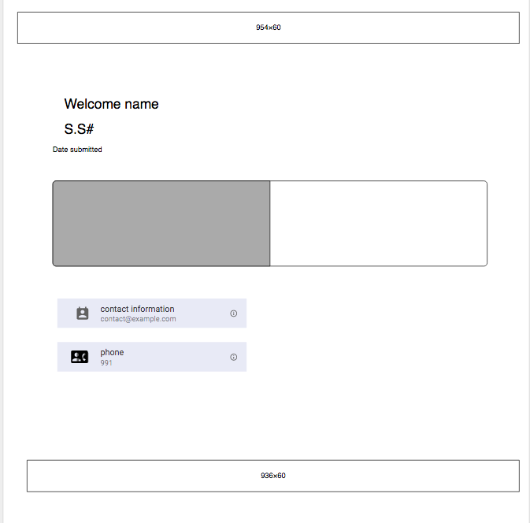
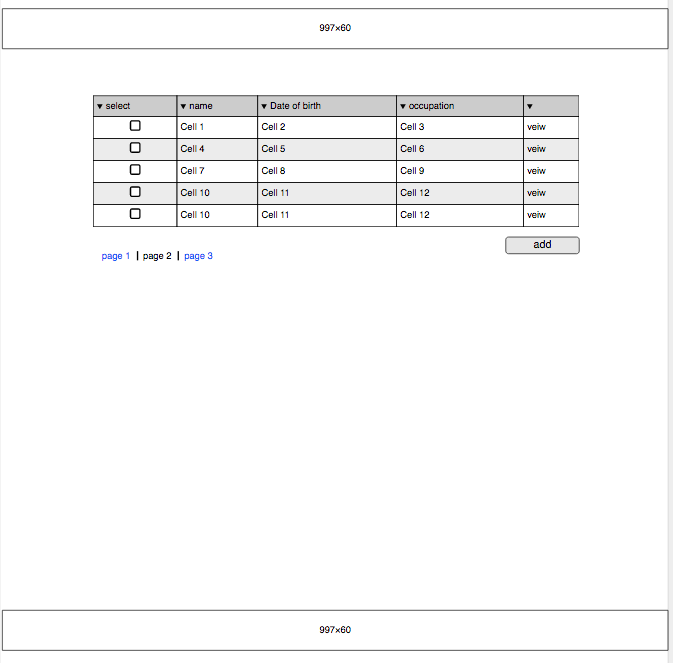
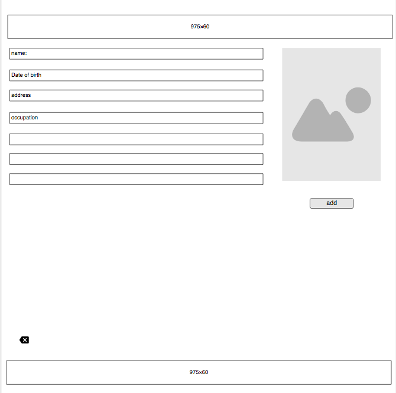
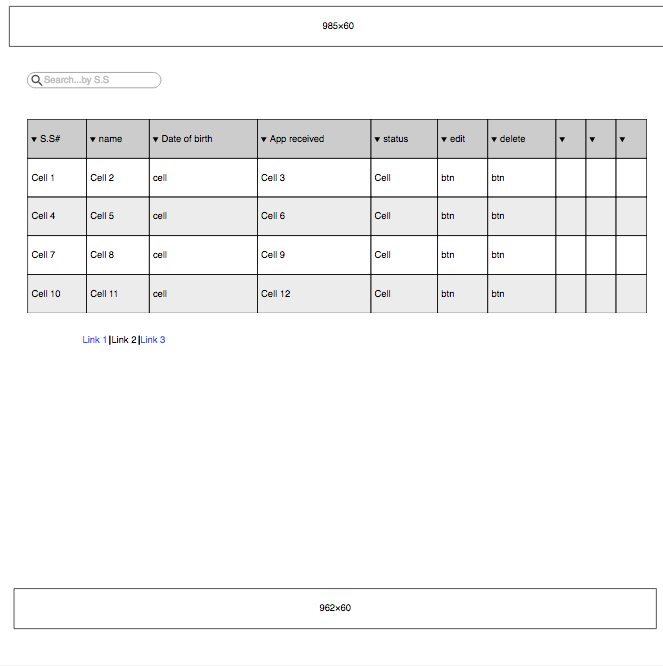
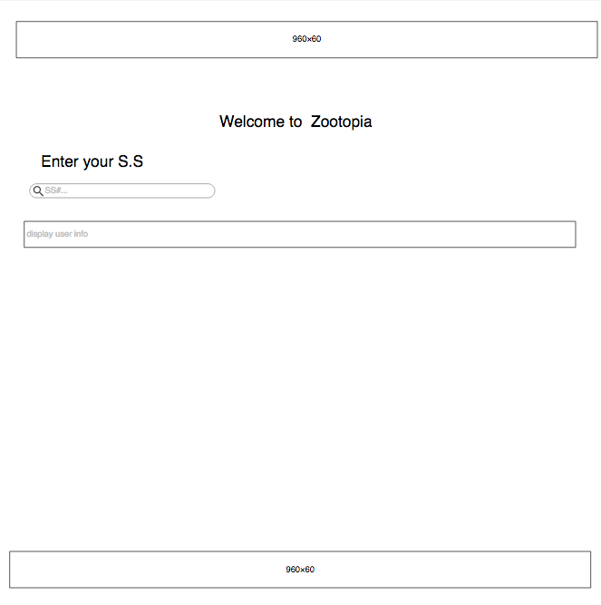
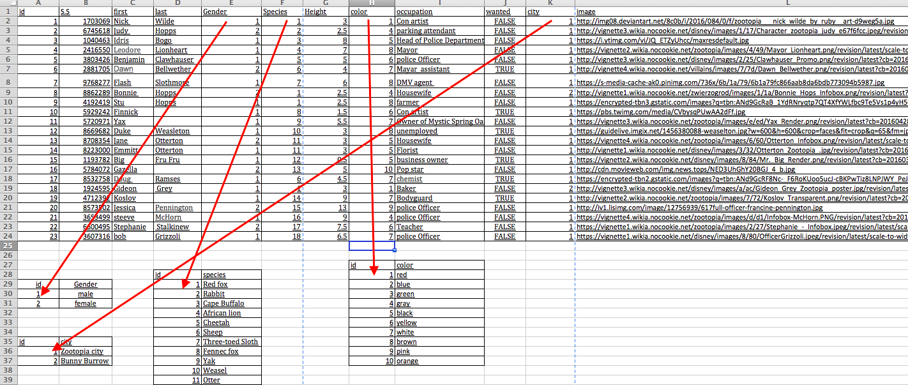

Embassy Passport Tracking System
-----------------------
My app is a passport tracking application for any Embassy . The embassies usually can pull the information of the people who wants to renew their passport  from their country Database then after adding the required information the can add the embassy releated information. the applicants using their Social secuirty number will be able to check the status of their application. 

Wireframes
----------

Landing page

Goverment Database

When the user click on the mignifier he should see 

Embassy Database

Applicant interface

User Stories
------------
* As an embassy staff, I want to be able to look in to the government database to see what information do they have about certain applicant
* As an embassy staff, I want to be able to import specific user/s information from the system
* As an embassy staff I want to be able to add date of application received, date it finishes and add telephone number. or to delete the applicant info
* As an embassy staff I want to change the passport issue process status.
* As embassy staff I want to know if the person who wants to renew his passport is wanted.

Pseudocode
----------
####part 1 : creating API
This part will create the API that will feed the embassy with applicants information.

*  Create tables and relations within the table.
*  create  seed file  and create the filled database
*	Create gov api with full crud functionality
	-	Add
	-	Delete
	-	Create
	-	Edit
*	Upload API to heroku

####part 2 : Creating the embassy main app
This part to be used only by embassy staff member
##### Section 1
pulling data from goverment database:

*  Display all records from gov api
*  Display one individually on click, inform the user if the applicant is wanted by the govenment.
*  Copy the required field to embassy databsae and inform the user if the record is already exist
* 	Search the database using social security number field
although the API is programmed to full crud funcionality, I did not want the embasy staff to delete or change the user information within the government database . because In my opioion he is suppose to do that.

##### Section 2
Embassy database:

*  Display the added field
*  Delete applicant information from embassy databse 
*  view applicant photo id
*  add the passport status
*  the date passport was received 
*  the date of the change of the status
*  create limited API that gives the applicant name , socail security number, date the application was recieved passport status and date of last update.

##### Section 3  : 
Creating the applicants app

*  get suitable free resposive template from internet
*  custimize the website
*  allow the user to Enter S.S
*  check if it's numbers only
*  search for the user in the embassy database
*  if the user is found in the database display his information
*  if the user was not found display a message .

---
Government database relation table

Technologies used/npm Modules
-----------
*  morgan
*  cors 
*  pg-promise
*  axios : for crud functionalty get/patch/put/delete
*  dotenv
*  nodemon: to track what happens in the server
*  postgress

<!--Download Project & Install
----------------

1. [Git clone or download this project]('https://github.com/andres-maza/project-2')
2. Create a PostgreSQL database called 'zootopia'
3. On your terminal, run psql -d project_2_db -f migrations/migrations.sql
4. If you haven't already, install nodemon package (npm install -g nodemon)
5. Run nodemon, app should be available on localhost:3000-->
