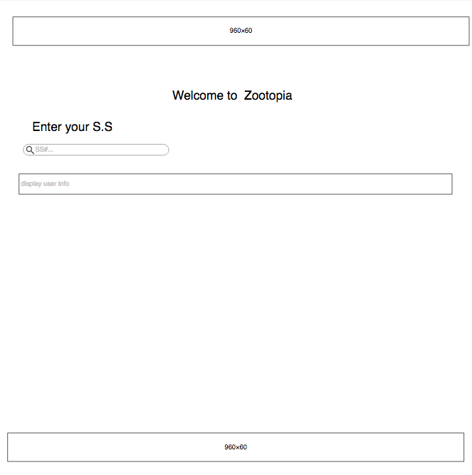

<a name="goback">

# Zootopia Embassy Clients Website
## Live: https://esraa-alaarag.github.io/zootopia/

</a>

## Table of Contents

1. [App description](#appdescription)
2. [User Stories](#userstories)
3. [Wireframes](#wireframesweb)
4. [Pseudocode](#pseudocode)
5. [Technologies used](#technologies)
6. [Ways to see the project](#project)

<a name="appdescription">

## APP DESCRIPTION:

Zootopia is an application for Zootopia Embassy that helps people who apply to renew their passport to track their passport renewal process.

### This project consists of three parts:

1.Zootopia API: 

This app works as Restful API to store all Zootopia citizens information and provide the embassy with detailed information on every citizen.
This API provides.

*	Basic CRUD (Create, Read, Update and Delete) with postman.

*	Cross-origin Resource Sharing using by using CORS middleware.

#### Live demo:https://zootopia-api.herokuapp.com/

2.Embassy of Zootopia app

The embassy staff can transfer and store the information of the people who wants to renew their passport from Zootopia Database to the embassy local database.

Once the person is added to the local database, the embassy staff can add more information. 

#### Live demo:

3.Zootopia citizen APP:

A customized HTML template for the citizen of Zootopia to check the status of their passport renewal application.

Applicants can enter their social security number to check the status of their passport.


#### Live demo:https://esraa-alaarag.github.io/zootopia/

</a>

<a name="userstories">

## USER STORIES:

- As a user, I want to use the app in the browser and on a mobile device.
-  As a user, I want to check to see the status of my application or if my new passport is ready by entering my social security number.
- As a user, I want to see the latest movies in Zootopia box office .
- As a user, I want to see Zootopia map.

<a name="wireframesweb">

## WIREFRAMES:

</a>

<a name="pseudocode">

## PSEUDOCODE:

1. pick suitable responsive template .

2. customize the template by changing pictures and text.
3. Add service section that contains input field where the user can input his/her social security number.
4. Validate the social security number.
5. Make Axios GET request to the embassy API to get user information. 
6. Return the information back to the user

</a>

## TECHNOLOGIES USED:

### Core Stack:
- Original Template was downloaded from https://startbootstrap.com/template-overviews/agency/
- HTML
- CSS
- JavaScript
- jQuery
- Heroku
- Git

### Middleware:

- axios
- react-routers

### APIs:

- Embassy API

### Also

- Trello (project boards)
- Postman (API and DB testing)

</a>

<a name="project">

## SEE THE PROJECT:

### Live Deployment of App: https://esraa-alaarag.github.io/zootopia/

Thanks :) 

</a>

[Go Back to the Table of Content](#goback)
